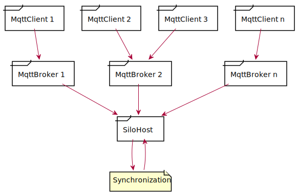
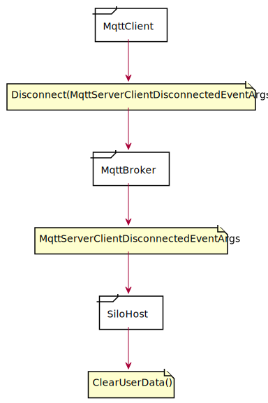
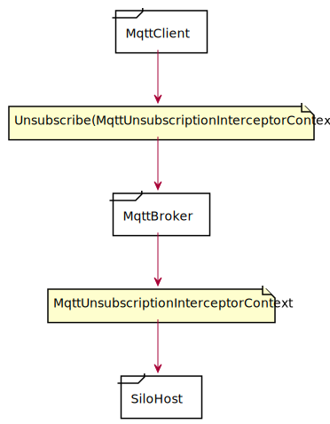

NetCoreMQTTExampleCluster
====================================

NetCoreMQTTExampleCluster is a project to run a multi MQTT broker system based on [MQTTnet](https://github.com/chkr1011/MQTTnet), [Dapper](https://stackexchange.github.io/Dapper/) (for database connection)
and [Orleans](https://dotnet.github.io/orleans/).
The project was written and tested in .NetCore 3.1 and NetStandard 2.1.

[](https://ci.appveyor.com/project/SeppPenner/netcoremqttexamplecluster)
[](https://github.com/SeppPenner/NetCoreMQTTExampleCluster/issues)
[](https://github.com/SeppPenner/NetCoreMQTTExampleCluster/network)
[](https://github.com/SeppPenner/NetCoreMQTTExampleCluster/stargazers)
[](https://raw.githubusercontent.com/SeppPenner/NetCoreMQTTExampleCluster/master/License.txt)
[](https://snyk.io/test/github/SeppPenner/NetCoreMQTTExampleCluster)

# Hints

Currently, only JSON is supported as MQTT payload.

# Setup

1. Create the database with the project `NetCoreMQTTExampleCluster.DatabaseSetup`, adapting the `appsettings.json` as required.
2. Start the projects `NetCoreMQTTExampleCluster.SiloHost` and `NetCoreMQTTExampleCluster.Cluster` as `several start projects`.
3. Connect with a MQTT client using `Test` as user, `test` as Password and any `clientId`. The user can only publish to the topics: `a/b` and `a/d` and subcribe to `d/e` and `e`.

# Use

* The broker can be reached at `localhost: 1883` (locally, unencrypted).
* If you add a valid certificate for a domain, it can be accessed under `yourdomain:8883`.
* Users can be managed in the database `mqtt`. The blacklists and whitelists are also saved there.
* The Orleans dashboard is available by default at http://localhost:4321.

# Projects

|Project|Description|
|-|-|
|`NetCoreMQTTExampleCluster.Models`|All data models are included here.|
|`NetCoreMQTTExampleCluster.PasswordHashGenerator`|Contains a program for generating a new password hash for user passwords.|
|`NetCoreMQTTExampleCluster.Cluster`|Contains an instance of a broker that connects to the SiloHost. "MQTT cluster client".|
|`NetCoreMQTTExampleCluster.DatabaseSetup`|Contains a project to set up the database initially.|
|`NetCoreMQTTExampleCluster.Grains`|Contains the implementations of the Orleans Grains.|
|`NetCoreMQTTExampleCluster.Grains.Interfaces`|Contains the interfaces of the Orleans Grains.|
|`NetCoreMQTTExampleCluster.SiloHost`|Contains the Orleans SiloHost.|
|`NetCoreMQTTExampleCluster.Storage`|Contains the administration of the database access.|

# Requirements

The project requires at least NetCore 3.1 and NetStandard 2.1.

# Settings

## NetCoreMQTTExampleCluster.Cluster

To do this, change the file `NetCoreMQTTExampleCluster.Cluster.json`.

|Setting|Description|Optional|
|-|-|-|
|`LogFolderPath`|The folder the service logs to.|No|
|`Port`|The encrypted port of the MQTT cluster client.|No|
|`UnencryptedPort`|The unencrypted port of the MQTT cluster client. (This should only be used locally).|Yes|
|`BrokerConnectionSettings`|The connection that the SiloHost establishes to the broker if a message is published by another MQTT cluster client.|No|
|`BrokerConnectionSettings.ClientId`|The ClientId of the connection.|No|
|`BrokerConnectionSettings.HostName`|The host name of the connection.|No|
|`BrokerConnectionSettings.Port`|The port of the connection.|No|
|`BrokerConnectionSettings.UserName`|The user name of the connection.|No|
|`BrokerConnectionSettings.Password`|The password of the connection.|No|
|`BrokerConnectionSettings.UseTls`|Whether TLS should be used for the connection.|No|
|`BrokerConnectionSettings.UseCleanSession`|Whether the "CleanSession" flag should be used for the connection.|No|
|`DatabaseSettings`|The database connection settings.|No|
|`DatabaseSettings.Host`|The host of the database connection.|No|
|`DatabaseSettings.Database`|The database of the database connection.|No|
|`DatabaseSettings.Username`|The user name of the database connection.|No|
|`DatabaseSettings.Password`|The password of the database connection.|No|
|`DatabaseSettings.Port`|The port of the database connection.|No|
|`OrleansConfiguration.ClusterOptions`|The connection to the Orleans SiloHost.|No|
|`OrleansConfiguration.ClusterOptions.ClusterId`|The CluserId of the Orleans-SiloHost.|No|
|`OrleansConfiguration.ClusterOptions.ServiceId`|The ServiceId of the Orleans-SiloHost.|No|

Example:

```json
{
  "LogFolderPath": "C:\\log",
  "Port": 8883,
  "UnencryptedPort": 1883,
  "BrokerConnectionSettings": {
    "ClientId": "mqtt-broker-cluster-1",
    "HostName": "localhost",
    "Port": 8883,
    "UserName": "mqtt-broker-cluster",
    "Password": "Test",
    "UseTls": true,
    "UseCleanSession": true
  },
  "DatabaseSettings": {
    "Host": "localhost",
    "Database": "mqtt",
    "Username": "postgres",
    "Password": "postgres",
    "Port": 5432
  },
  "OrleansConfiguration": {
    "ClusterOptions": {
      "ClusterId": "mqtt001",
      "ServiceId": "mqtt-silo-001-A"
    }
  }
}
```

## NetCoreMQTTExampleCluster.DatabaseSetup

To do this, change the file `appsettings.json`.

|Setting|Description|Optional|
|-|-|-|
|`Host`|The host of the database connection.|No|
|`Database`|The database of the database connection.|No|
|`Username`|The user name of the database connection.|No|
|`Password`|The password of the database connection.|No|
|`Port`|The port of the database connection.|No|
|`Pooling`|A value that indicates whether pooling should be used when connecting to the database.|No|

Example:

```json
{
  "Host": "localhost",
  "Database": "mqtt",
  "Username": "postgres",
  "Password": "postgres",
  "Port": 5432,
  "Pooling" : false
}
```

## NetCoreMQTTExampleCluster.SiloHost

To do this, change the file `NetCoreMQTTExampleCluster.Cluster.json`.

|Setting|Description|Optional|
|-|-|-|
|`LogFolderPath`|The folder the service logs to.|No|
|`Database`|The database connection settings.|No|
|`Database.Host`|The host of the database connection.|No|
|`Database.Database`|The database of the database connection.|No|
|`Database.Username`|The user name of the database connection.|No|
|`Database.Password`|The password of the database connection.|No|
|`Database.Port`|The port of the database connection.|No|
|`Orleans`|The configuration of the Orleans SiloHost.|No|
|`Orleans.ClusterOptions`|The cluster configuration of the Orleans-SiloHost.|No|
|`Orleans.ClusterOptions.ClusterId`|The CluserId of the Orleans-SiloHost.|No|
|`Orleans.ClusterOptions.ServiceId`|The ServiceId of the Orleans-SiloHost.|No|
|`Orleans.DashboardOptions`|The configuration of the Orleans dashboard of the Orleans SiloHost.|No|
|`Orleans.DashboardOptions.CounterUpdateIntervalMs`|The update interval of the Orleans dashboard.|No|
|`Orleans.DashboardOptions.Port`|The port of the Orleans dashboard.|No|
|`Orleans.EndpointOptions`|The endpoint configuration of the Orleans SiloHost.|No|
|`Orleans.EndpointOptions.AdvertisedIPAddress`|The Orleans SiloHost IP address.|No|
|`Orleans.EndpointOptions.SiloPort`|The Orleans SiloHost port.|No|
|`Orleans.EndpointOptions.GatewayPort`|The port of the Orleans SiloHost gateway.|No|
|`Orleans.EndpointOptions.SiloListeningEndpointAddress`|The Orleans SiloHost IP address.|No|
|`Orleans.EndpointOptions.SiloListeningEndpointPort`|The Port des Orleans-SiloHost.|No|
|`Orleans.EndpointOptions.GatewayListeningEndpointAddress`|The IP address of the Orleans SiloHost gateway.|No|
|`Orleans.EndpointOptions.GatewayListeningEndpointPort`|The port of the Orleans SiloHost gateway.|No|

Example:

```json
{
  "LogFolderPath": "C:\\log",
  "Database": {
    "Host": "localhost",
    "Database": "mqtt",
    "Username": "postgres",
    "Password": "postgres",
    "Port": 5432
  },
  "Orleans": {
    "ClusterOptions": {
      "ClusterId": "mqtt001",
      "ServiceId": "mqtt-silo-001-A"
    },
    "DashboardOptions": {
      "CounterUpdateIntervalMs": 1000,
      "Port": 4321
    },
    "EndpointOptions": {
      "AdvertisedIPAddress": "127.0.0.1",
      "SiloPort": 7101,
      "GatewayPort": 7102,
      "SiloListeningEndpointAddress": "127.0.0.1",
      "SiloListeningEndpointPort": 7101,
      "GatewayListeningEndpointAddress": "127.0.0.1",
      "GatewayListeningEndpointPort": 7102
    }
  }
}
```

# Structure


The MQTT clients connect to any MQTT broker. All inquiries are forwarded to the SiloHost and synchronized there.

# Schedule

## General

Every action is saved by the SiloHost into the table `eventlog`.

## Broker connect


The MQTT broker connects to the SiloHost by specifying the `BrokerConnectionSettings` and a random `brokerId` (GUUID).
The SiloHost stores the `BrokerConnectionSettings` for the `brokerId` in a `Dictionary`.

## Broker disonnect


The MQTT broker disconnects from the SiloHost by specifying its `brokerId`.
The SiloHost removes the entry with the `brokerId` from its `Dictionary`.

## Client connect


The MQTT client connects to the MQTT broker by specifying the `MqttConnectionValidatorContext`. The MQTT broker forwards the connection request to the SiloHost as `SimpleMqttConnectionValidatorContext`. This validates the data and returns the MQTT broker whether the MQTT client is allowed to connect or not.

## Client disconnect



The MQTT client passes the `MqttServerClientDisconnectedEventArgs` to the MQTT broker. The broker passes this on to the SiloHost. This deletes all saved client data from its list.

## Client subscribe


The MQTT client passes the `MqttSubscriptionInterceptorContext` to the MQTT broker. The broker passes this on to the SiloHost. This validates the data and returns the MQTT broker whether the MQTT client can subscribe or not.

## Client unsubscribe



The MQTT client passes the `MqttServerClientUnsubscribedTopicEventArgs` to the MQTT broker. The broker passes this on to the SiloHost. In this case, the SiloHost does not have to do anything else.

## Client publish


The MQTT client passes the `MqttApplicationMessageInterceptorContext` to the MQTT broker. The broker passes this on to the SiloHost and supplements his `brokerId`. The SiloHost validates the data and returns to the MQTT broker whether the MQTT client is allowed to publish or not. If this is the case, the SiloHost sends the packet to all other brokers except the one who initially sent the message.

# Temporarily locking clients
Users can be blocked temporarily (until the end of the current month) if they exceed a certain data quota.
Therefore, the parameter `ThrottleUser` in the `User` table must be set to `true` and `MonthlyByteLimit` to the desired threshold in bytes.

# Attention:
* Only the following [UTF-8](https://www.utf8-chartable.de/unicode-utf8-table.pl) chars are supported for topics:

|Unicode code point|character|UTF-8(hex.)|Name|
|-|-|-|-|
|U+0021|`!`|21|EXCLAMATION MARK|
|U+0022|`"`|22|QUOTATION MARK|
|U+0023|`#`|23|NUMBER SIGN|
|U+0024|`$`|24|DOLLAR SIGN|
|U+0025|`%`|25|PERCENT SIGN|
|U+0026|`&`|26|AMPERSAND|
|U+0027|`'`|27|APOSTROPHE|
|U+0028|`(`|28|LEFT PARENTHESIS|
|U+0029|`)`|29|RIGHT PARENTHESIS|
|U+002A|`*`|2a|ASTERISK|
|U+002B|`+`|2b|PLUS SIGN|
|U+002C|`,`|2c|COMMA|
|U+002D|`-`|2d|HYPHEN-MINUS|
|U+002E|`.`|2e|FULL STOP|
|U+002F|`/`|2f|SOLIDUS|
|U+0030|`0`|30|DIGIT ZERO|
|U+0031|`1`|31|DIGIT ONE|
|U+0032|`2`|32|DIGIT TWO|
|U+0033|`3`|33|DIGIT THREE|
|U+0034|`4`|34|DIGIT FOUR|
|U+0035|`5`|35|DIGIT FIVE|
|U+0036|`6`|36|DIGIT SIX|
|U+0037|`7`|37|DIGIT SEVEN|
|U+0038|`8`|38|DIGIT EIGHT|
|U+0039|`9`|39|DIGIT NINE|
|U+003A|`:`|3a|COLON|
|U+003B|`;`|3b|SEMICOLON|
|U+003C|`<`|3c|LESS-THAN SIGN|
|U+003D|`=`|3d|EQUALS SIGN|
|U+003E|`>`|3e|GREATER-THAN SIGN|
|U+003F|`?`|3f|QUESTION MARK|
|U+0040|`@`|40|COMMERCIAL AT|
|U+0041|`A`|41|LATIN CAPITAL LETTER A|
|U+0042|`B`|42|LATIN CAPITAL LETTER B|
|U+0043|`C`|43|LATIN CAPITAL LETTER C|
|U+0044|`D`|44|LATIN CAPITAL LETTER D|
|U+0045|`E`|45|LATIN CAPITAL LETTER E|
|U+0046|`F`|46|LATIN CAPITAL LETTER F|
|U+0047|`G`|47|LATIN CAPITAL LETTER G|
|U+0048|`H`|48|LATIN CAPITAL LETTER H|
|U+0049|`I`|49|LATIN CAPITAL LETTER I|
|U+004A|`J`|4a|LATIN CAPITAL LETTER J|
|U+004B|`K`|4b|LATIN CAPITAL LETTER K|
|U+004C|`L`|4c|LATIN CAPITAL LETTER L|
|U+004D|`M`|4d|LATIN CAPITAL LETTER M|
|U+004E|`N`|4e|LATIN CAPITAL LETTER N|
|U+004F|`O`|4f|LATIN CAPITAL LETTER O|
|U+0050|`P`|50|LATIN CAPITAL LETTER P|
|U+0051|`Q`|51|LATIN CAPITAL LETTER Q|
|U+0052|`R`|52|LATIN CAPITAL LETTER R|
|U+0053|`S`|53|LATIN CAPITAL LETTER S|
|U+0054|`T`|54|LATIN CAPITAL LETTER T|
|U+0055|`U`|55|LATIN CAPITAL LETTER U|
|U+0056|`V`|56|LATIN CAPITAL LETTER V|
|U+0057|`W`|57|LATIN CAPITAL LETTER W|
|U+0058|`X`|58|LATIN CAPITAL LETTER X|
|U+0059|`Y`|59|LATIN CAPITAL LETTER Y|
|U+005A|`Z`|5a|LATIN CAPITAL LETTER Z|
|U+005B|`[`|5b|LEFT SQUARE BRACKET|
|U+005C|`\`|5c|REVERSE SOLIDUS|
|U+005D|`]`|5d|RIGHT SQUARE BRACKET|
|U+005E|`^`|5e|CIRCUMFLEX ACCENT|
|U+005F|`_`|5f|LOW LINE|
|U+0060|<code>`</code>|60|GRAVE ACCENT|
|U+0061|`a`|61|LATIN SMALL LETTER A|
|U+0062|`b`|62|LATIN SMALL LETTER B|
|U+0063|`c`|63|LATIN SMALL LETTER C|
|U+0064|`d`|64|LATIN SMALL LETTER D|
|U+0065|`e`|65|LATIN SMALL LETTER E|
|U+0066|`f`|66|LATIN SMALL LETTER F|
|U+0067|`g`|67|LATIN SMALL LETTER G|
|U+0068|`h`|68|LATIN SMALL LETTER H|
|U+0069|`i`|69|LATIN SMALL LETTER I|
|U+006A|`j`|6a|LATIN SMALL LETTER J|
|U+006B|`k`|6b|LATIN SMALL LETTER K|
|U+006C|`l`|6c|LATIN SMALL LETTER L|
|U+006D|`m`|6d|LATIN SMALL LETTER M|
|U+006E|`n`|6e|LATIN SMALL LETTER N|
|U+006F|`o`|6f|LATIN SMALL LETTER O|
|U+0070|`p`|70|LATIN SMALL LETTER P|
|U+0071|`q`|71|LATIN SMALL LETTER Q|
|U+0072|`r`|72|LATIN SMALL LETTER R|
|U+0073|`s`|73|LATIN SMALL LETTER S|
|U+0074|`t`|74|LATIN SMALL LETTER T|
|U+0075|`u`|75|LATIN SMALL LETTER U|
|U+0076|`v`|76|LATIN SMALL LETTER V|
|U+0077|`w`|77|LATIN SMALL LETTER W|
|U+0078|`x`|78|LATIN SMALL LETTER X|
|U+0079|`y`|79|LATIN SMALL LETTER Y|
|U+007A|`z`|7a|LATIN SMALL LETTER Z|
|U+007B|`{`|7b|LEFT CURLY BRACKET|
|U+007C|`|`|7c|VERTICAL LINE|
|U+007D|`}`|7d|RIGHT CURLY BRACKET|
|U+007E|`~`|7e|TILDE|
|U+00A1|`¡`|c2 a1|INVERTED EXCLAMATION MARK|
|U+00A2|`¢`|c2 a2|CENT SIGN|
|U+00A3|`£`|c2 a3|POUND SIGN|
|U+00A4|`¤`|c2 a4|CURRENCY SIGN|
|U+00A5|`¥`|c2 a5|YEN SIGN|
|U+00A6|`¦`|c2 a6|BROKEN BAR|
|U+00A7|`§`|c2 a7|SECTION SIGN|
|U+00A8|`¨`|c2 a8|DIAERESIS|
|U+00A9|`©`|c2 a9|COPYRIGHT SIGN|
|U+00AA|`ª`|c2 aa|FEMININE ORDINAL INDICATOR|
|U+00AB|`«`|c2 ab|LEFT-POINTING DOUBLE ANGLE QUOTATION MARK|
|U+00AC|`¬`|c2 ac|NOT SIGN|
|U+00AE|`®`|c2 ae|REGISTERED SIGN|
|U+00AF|`¯`|c2 af|MACRON|
|U+00B0|`°`|c2 b0|DEGREE SIGN|
|U+00B1|`±`|c2 b1|PLUS-MINUS SIGN|
|U+00B2|`²`|c2 b2|SUPERSCRIPT TWO|
|U+00B3|`³`|c2 b3|SUPERSCRIPT THREE|
|U+00B4|`´`|c2 b4|ACUTE ACCENT|
|U+00B5|`µ`|c2 b5|MICRO SIGN|
|U+00B6|`¶`|c2 b6|PILCROW SIGN|
|U+00B7|`·`|c2 b7|MIDDLE DOT|
|U+00B8|`¸`|c2 b8|CEDILLA|
|U+00B9|`¹`|c2 b9|SUPERSCRIPT ONE|
|U+00BA|`º`|c2 ba|MASCULINE ORDINAL INDICATOR|
|U+00BB|`»`|c2 bb|RIGHT-POINTING DOUBLE ANGLE QUOTATION MARK|
|U+00BC|`¼`|c2 bc|VULGAR FRACTION ONE QUARTER|
|U+00BD|`½`|c2 bd|VULGAR FRACTION ONE HALF|
|U+00BE|`¾`|c2 be|VULGAR FRACTION THREE QUARTERS|
|U+00BF|`¿`|c2 bf|INVERTED QUESTION MARK|
|U+00C0|`À`|c3 80|LATIN CAPITAL LETTER A WITH GRAVE|
|U+00C1|`Á`|c3 81|LATIN CAPITAL LETTER A WITH ACUTE|
|U+00C2|`Â`|c3 82|LATIN CAPITAL LETTER A WITH CIRCUMFLEX|
|U+00C3|`Ã`|c3 83|LATIN CAPITAL LETTER A WITH TILDE|
|U+00C4|`Ä`|c3 84|LATIN CAPITAL LETTER A WITH DIAERESIS|
|U+00C5|`Å`|c3 85|LATIN CAPITAL LETTER A WITH RING ABOVE|
|U+00C6|`Æ`|c3 86|LATIN CAPITAL LETTER AE|
|U+00C7|`Ç`|c3 87|LATIN CAPITAL LETTER C WITH CEDILLA|
|U+00C8|`È`|c3 88|LATIN CAPITAL LETTER E WITH GRAVE|
|U+00C9|`É`|c3 89|LATIN CAPITAL LETTER E WITH ACUTE|
|U+00CA|`Ê`|c3 8a|LATIN CAPITAL LETTER E WITH CIRCUMFLEX|
|U+00CB|`Ë`|c3 8b|LATIN CAPITAL LETTER E WITH DIAERESIS|
|U+00CC|`Ì`|c3 8c|LATIN CAPITAL LETTER I WITH GRAVE|
|U+00CD|`Í`|c3 8d|LATIN CAPITAL LETTER I WITH ACUTE|
|U+00CE|`Î`|c3 8e|LATIN CAPITAL LETTER I WITH CIRCUMFLEX|
|U+00CF|`Ï`|c3 8f|LATIN CAPITAL LETTER I WITH DIAERESIS|
|U+00D0|`Ð`|c3 90|LATIN CAPITAL LETTER ETH|
|U+00D1|`Ñ`|c3 91|LATIN CAPITAL LETTER N WITH TILDE|
|U+00D2|`Ò`|c3 92|LATIN CAPITAL LETTER O WITH GRAVE|
|U+00D3|`Ó`|c3 93|LATIN CAPITAL LETTER O WITH ACUTE|
|U+00D4|`Ô`|c3 94|LATIN CAPITAL LETTER O WITH CIRCUMFLEX|
|U+00D5|`Õ`|c3 95|LATIN CAPITAL LETTER O WITH TILDE|
|U+00D6|`Ö`|c3 96|LATIN CAPITAL LETTER O WITH DIAERESIS|
|U+00D7|`×`|c3 97|MULTIPLICATION SIGN|
|U+00D8|`Ø`|c3 98|LATIN CAPITAL LETTER O WITH STROKE|
|U+00D9|`Ù`|c3 99|LATIN CAPITAL LETTER U WITH GRAVE|
|U+00DA|`Ú`|c3 9a|LATIN CAPITAL LETTER U WITH ACUTE|
|U+00DB|`Û`|c3 9b|LATIN CAPITAL LETTER U WITH CIRCUMFLEX|
|U+00DC|`Ü`|c3 9c|LATIN CAPITAL LETTER U WITH DIAERESIS|
|U+00DD|`Ý`|c3 9d|LATIN CAPITAL LETTER Y WITH ACUTE|
|U+00DE|`Þ`|c3 9e|LATIN CAPITAL LETTER THORN|
|U+00DF|`ß`|c3 9f|LATIN SMALL LETTER SHARP S|
|U+00E0|`à`|c3 a0|LATIN SMALL LETTER A WITH GRAVE|
|U+00E1|`á`|c3 a1|LATIN SMALL LETTER A WITH ACUTE|
|U+00E2|`â`|c3 a2|LATIN SMALL LETTER A WITH CIRCUMFLEX|
|U+00E3|`ã`|c3 a3|LATIN SMALL LETTER A WITH TILDE|
|U+00E4|`ä`|c3 a4|LATIN SMALL LETTER A WITH DIAERESIS|
|U+00E5|`å`|c3 a5|LATIN SMALL LETTER A WITH RING ABOVE|
|U+00E6|`æ`|c3 a6|LATIN SMALL LETTER AE|
|U+00E7|`ç`|c3 a7|LATIN SMALL LETTER C WITH CEDILLA|
|U+00E8|`è`|c3 a8|LATIN SMALL LETTER E WITH GRAVE|
|U+00E9|`é`|c3 a9|LATIN SMALL LETTER E WITH ACUTE|
|U+00EA|`ê`|c3 aa|LATIN SMALL LETTER E WITH CIRCUMFLEX|
|U+00EB|`ë`|c3 ab|LATIN SMALL LETTER E WITH DIAERESIS|
|U+00EC|`ì`|c3 ac|LATIN SMALL LETTER I WITH GRAVE|
|U+00ED|`í`|c3 ad|LATIN SMALL LETTER I WITH ACUTE|
|U+00EE|`î`|c3 ae|LATIN SMALL LETTER I WITH CIRCUMFLEX|
|U+00EF|`ï`|c3 af|LATIN SMALL LETTER I WITH DIAERESIS|
|U+00F0|`ð`|c3 b0|LATIN SMALL LETTER ETH|
|U+00F1|`ñ`|c3 b1|LATIN SMALL LETTER N WITH TILDE|
|U+00F2|`ò`|c3 b2|LATIN SMALL LETTER O WITH GRAVE|
|U+00F3|`ó`|c3 b3|LATIN SMALL LETTER O WITH ACUTE|
|U+00F4|`ô`|c3 b4|LATIN SMALL LETTER O WITH CIRCUMFLEX|
|U+00F5|`õ`|c3 b5|LATIN SMALL LETTER O WITH TILDE|
|U+00F6|`ö`|c3 b6|LATIN SMALL LETTER O WITH DIAERESIS|
|U+00F7|`÷`|c3 b7|DIVISION SIGN|
|U+00F8|`ø`|c3 b8|LATIN SMALL LETTER O WITH STROKE|
|U+00F9|`ù`|c3 b9|LATIN SMALL LETTER U WITH GRAVE|
|U+00FA|`ú`|c3 ba|LATIN SMALL LETTER U WITH ACUTE|
|U+00FB|`û`|c3 bb|LATIN SMALL LETTER U WITH CIRCUMFLEX|
|U+00FC|`ü`|c3 bc|LATIN SMALL LETTER U WITH DIAERESIS|
|U+00FD|`ý`|c3 bd|LATIN SMALL LETTER Y WITH ACUTE|
|U+00FE|`þ`|c3 be|LATIN SMALL LETTER THORN|
|U+00FF|`ÿ`|c3 bf|LATIN SMALL LETTER Y WITH DIAERESIS|

## Create an openssl certificate:
```bash
openssl req -x509 -newkey rsa:4096 -keyout key.pem -out cert.pem -days 365
openssl pkcs12 -export -out certificate.pfx -inkey key.pem -in cert.pem
```

An example certificate is in the folder. Password for all is `test`.

Change history
--------------

* **Version 1.2.0.0 (2020-05-06)** : Switched to Windows service template.
* **Version 1.1.0.0 (2020-05-06)** : Added log folder path.
* **Version 1.0.0.0 (2020-04-19)** : 1.0 release.